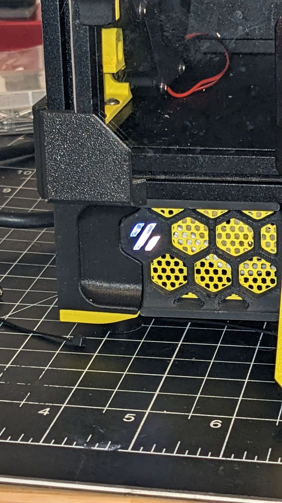
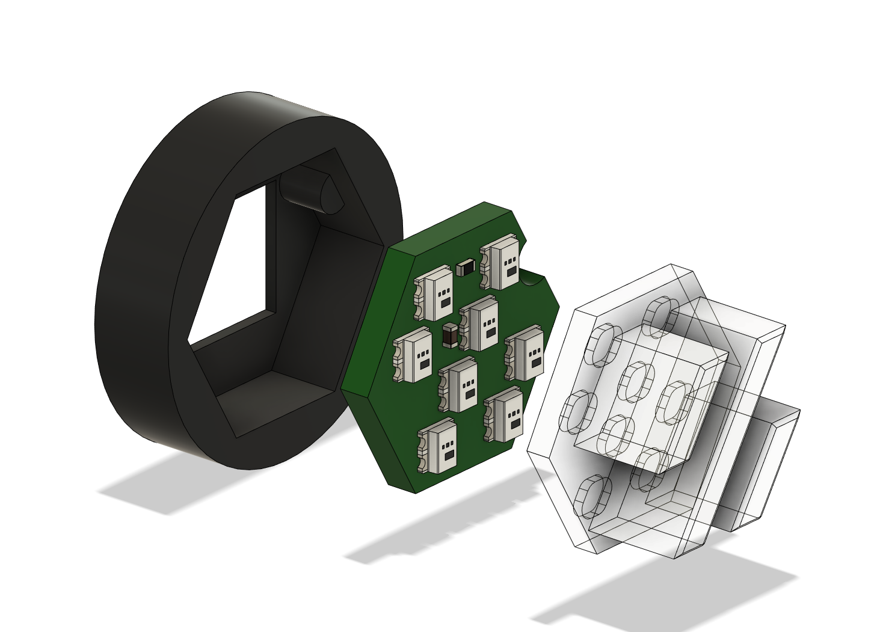

# V0 RGB Skirt Logo

 RGB Voron Logos in the V0.2 Skirts

## BOM

2x Rainbow Barf LED Logo PCB - https://github.com/tanaes/whopping_Voron_mods/tree/main/LEDs/Rainbow_Barf_Logo_LED

## Printing

- Print 2 [[c]_logo_insert_x2.stl](./STL/%5Bc%5D_logo_insert_x2.stl) in a clear or white filament 
- Print 2 [[o]_rainbow_barf_carrier_x2.stl](./STL/%5Bo%5D_rainbow_barf_carrier_x2.stl) in an opaque filament to prevent light bleed.

## Assembly

- Route the wires through the hole in the back of the carrier before soldering them to the PCB.
- push the PCB into the carrier, and glue the logo insert into place on top.
- replace the logo inserts in the stock V0.2 skirts with the new ones.
